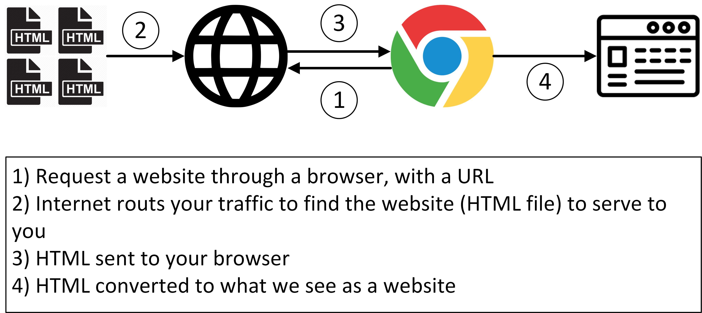
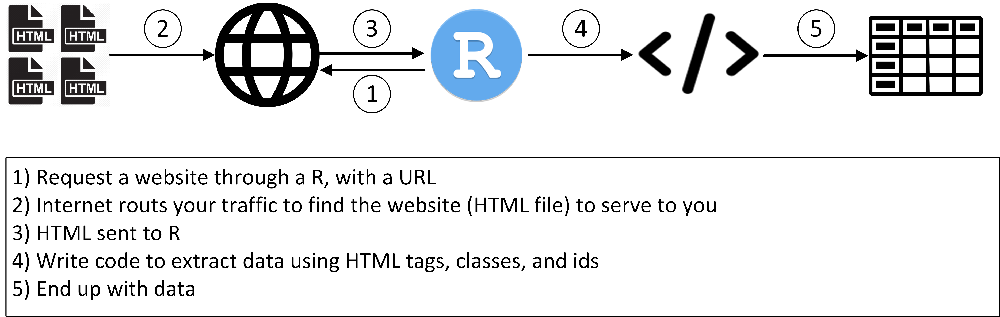
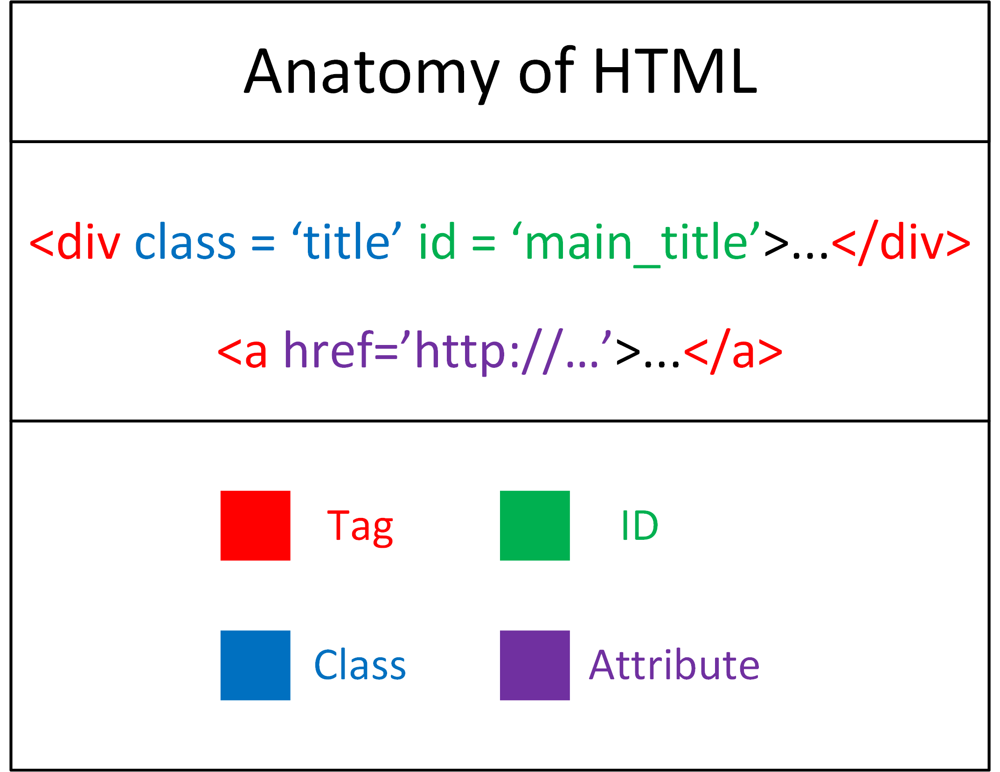

```{r global_options, include=FALSE}
knitr::opts_chunk$set(warning=FALSE, message=FALSE)
```

## Today

1. Understand basic principles of HTML
2. Understand basic principles of websites/web requests
3. Scrape single nodes from web pages


---

## How the internet works

<center></center>

---

## How web scraping works

<center></center>

---


## HTML

- Let's talk about the basics of HTML

<center></center>

---

## HTML

- HTML is a markup language that is interpreted by a web browser

- Open notepad and write this text:

```
<h1>My Site Title</h1>

<h3>My Name</h3>

<p>My website is about...</p>

<a href = 'https://google.com'>Link to google</a>

```

- Open your file in a web browser...you made a website!

---

## CSS

- CSS is a way to style HTML code

- Add this to the top of your file:

```
<style>
  h1{
    color: red;
  }
</style>
```

- Refresh your webpage to see how the styling is applied

---

## CSS

- CSS relies on tags, classes, and ids to apply styling:

- Add some classes and apply the red font only to them:

```
<style>
  .my_color_class{
    color: red;
  }
</style>

<h1>My Site Title</h1>

<h3 class = 'my_color_class'>My Name</h3>

<p class = 'my_color_class'>My website is about...</p>

<a href = 'https://google.com'>Link to google</a>


```

- Note how you select a class with `.`

- You can select an id with #

---

## CSS

- Let's add an id and color based on it:

```
<style>
  .my_color_class{
    color: red;
  }
  
  #my_id{
    color: blue;
  }
  
</style>

<h1 id = 'my_id'>My Site Title</h1>

<h3 class = 'my_color_class'>My Name</h3>

<p class = 'my_color_class'>My website is about...</p>

<a href = 'https://google.com'>Link to google</a>

```

---

## Web Scraping

- For our purposes, we're not worried about web page style...

- But we can use the tags, classes, and ids to extract things from html!

- Check out: <a href = "http://flukeout.github.io">flukeout.github.io</a> for practice with css selectors
---

## Simple "web" scrape

- Let's scrape the file we just created!

```{r}
library(rvest)

read_html('test_site.html') %>%
  html_node('h1') %>%
  html_text()
```

- Or

```{r}
read_html('test_site.html') %>%
  html_node('#my_id') %>%
  html_text()
```

---

## Simple "web" scrape

- We can also scrape classes:

```{r}
read_html('test_site.html') %>%
  html_node('.my_color_class') %>%
  html_text()
```

- Or, if we want both of them

```{r}
read_html('test_site.html') %>%
  html_nodes('.my_color_class') %>%
  html_text()
```

---

## Simple "web" scrape

- We can also scrape information from links:

```{r}
read_html('test_site.html') %>%
  html_node('a') %>%
  html_text()
```

```{r}
read_html('test_site.html') %>%
  html_node('a') %>%
  html_attr('href')
```


---

## "Real" Web Scraping

- Most web pages are more complicated than our simple one...

- ...but the process to scrape them is the same!  

- The trick is finding the right selectors - so be patient and practice.

---

## Legal Issues?

- Web scraping is not unethical or illegal if you are only accessing data you already have access to
    - For example, scraping ESPN headlines every 2 hours is functionally the same as manually copy/pasting them every 2 hours.
    
- However, scraping many websites is against their terms of use (though not illegal).
    
- It is very easy to accidentally spam a website with requests while scraping - this is why websites don't like it when people scrape their data.

- Be a good citizen and make sure make the fewest requests to a website that you can.  This will ensure you don't get blocked.

- Rules to follow: Don't do anything via scraping you wouldn't do on a browser AND make sure you fully understand any web scraping code before you run it.  Ignorance is not a valid excuse.
    


